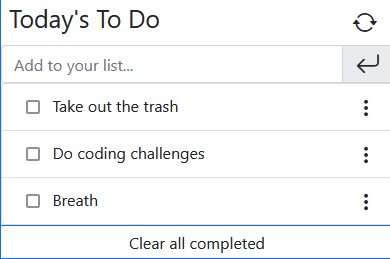

# Todo List

> In this project, you'll be able to do CRUD actions in a list of Taks.

Later on you can add tasks by yourself pressing enter in the input area or click the arrow icon.
Edit the previosly added task.
Clear the tasks one by one clicking in the label, or use the clear all completed button.
Checkout the demo video for a hands free demostration!

## Built With

- Javascript/HTML/CSS
- Webpack 

## Live Demo

[Live Demo Link](https://carloso0114.github.io/Todo-List-2.0/)

https://user-images.githubusercontent.com/14119855/126028712-e4fa15ff-0479-4b44-bf80-64d065442d5d.mp4

### Prerequisites
- Browser
- Text Editor (VSCode is suggested.)
- Git installed 
- Its recommended to have a screen resolution equal or greater than 1280*720p as the project is not meant to be responsive.

### Setup
- Open Terminal
- In your prefered folder, run <code>git clone `https://github.com/carloso0114/Todo-List-2.0.git`</code>
- Open the `index.html` in the /dist folder to run the compiled webpack project.
- Optional: If you want to edit the project you must run:
  <code>npm i</code>
  edit the files inside /src and run :
  <code>npm run build</code>

### Usage
-Fill the task inputs with your task, and press Enter and you'll be able to see your To-do Task. Later on you could click on the check Box to mark it as completed.

## Authors

👤  **Carlos Ospina**

- GitHub: [carloso0114](https://github.com/carloso0114)
- LinkedIn: [Carlos Ospina](https://www.linkedin.com/in/carlosospina/)

## 🤝 Contributing

Contributions, issues, and feature requests are welcome!

Feel free to check the [issues page](https://github.com/carloso0114/Todo-List-2.0/issues).

## Show your support

Give a ⭐️ if you like this project!

## Acknowledgments

- Hat tip to anyone whose code was used
- Inspiration
- etc

## 📝 License

This project is [MIT](./MIT.md) licensed.
